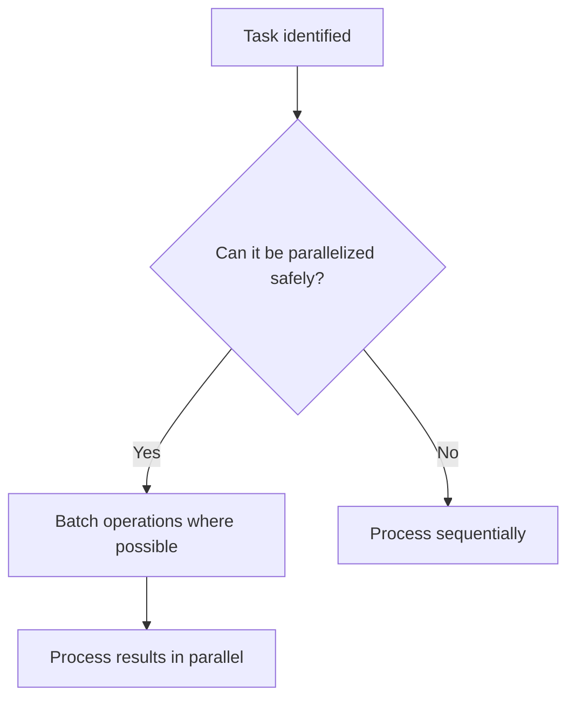

# Thinking Patterns

## Problem-Solving Philosophy

- Programming is a discovery process: Solutions and understanding grow together
- Early visualization: For non-trivial tasks, make your thinking visible with diagrams/pseudocode/sketches **within 2 minutes**
- **MUST USE DIAGRAMS**: For explaining system architecture, data flows, or component interactions, you MUST create a diagram using an appropriate tool (e.g., Mermaid, PlantUML, draw.io)
- Treat ideas as guesses to test: Update instantly based on facts
- Parallel exploration: For complex challenges, attempt multiple ideas at the same time
- Shift perspectives: Move appropriately between system-level ⇄ component-level views
- Use unclear points to get feedback: Highlight them and invite early input

---

## Problem Analysis Approach

- Start investigation from **core parts (core modules, shared logic, config files)**, not just the file that threw the error
- Check all affected areas before proposing solutions
- Always ask clarifying questions before implementation

---

# Development Practices

## Parallel Execution

- Analyze all parallelization opportunities at the start of task planning
- Batch I/O operations (searches, API calls, reads) where safe
- Execute independent tasks concurrently (e.g., frontend/backend, multiple file searches)

### Parallelism Decision Flow

