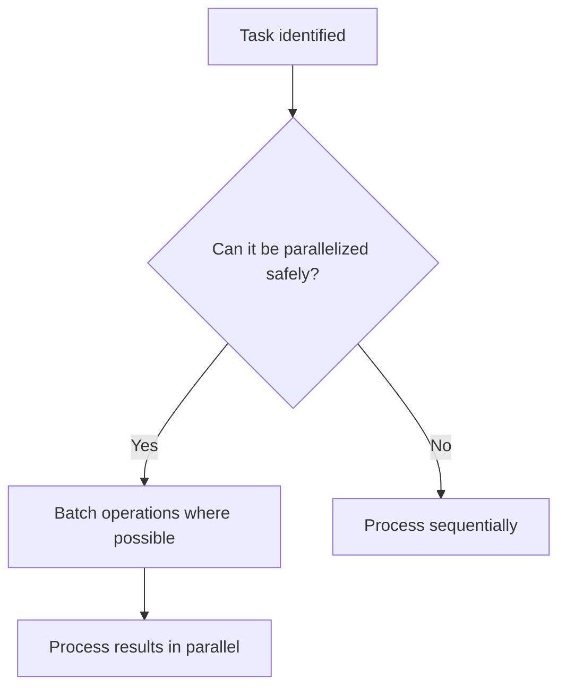

# Thinking Patterns

## Problem-Solving Philosophy

- Programming is a discovery process: Solutions and understanding grow together
- Early visualization: For non-trivial tasks, make your thinking visible with diagrams/pseudocode/sketches early
- Diagrams are effective for explaining system architecture, data flows, or component interactions (Mermaid, PlantUML, draw.io). Use them when visualization actually clarifies — not as a checkbox
- Treat ideas as guesses to test: Update instantly based on facts
- Parallel exploration: For complex challenges, compare multiple ideas. Prefer batched reads/searches in the main session; do not launch subagents only to create parallelism.
- Shift perspectives: Move appropriately between system-level and component-level views
- Use unclear points to get feedback: Highlight them and invite early input

---

## Reasoning Quality

- **Metacognition**: On important or hard-to-reverse decisions, step back and re-examine your own reasoning — purpose, premises, scope, and long-term, whole-system impact. Do not stay anchored to an earlier conclusion or the first framing. Doubt received "common sense" and the assumed shape of the problem; derive the root purpose and cause from confirmed facts and constraints, and self-audit more than once.
- **Global over local optimization**: Optimize for the whole system and the long term, not the local or immediate fix. When a narrow win conflicts with the larger design, surface the trade-off instead of silently taking it.
- **Adversarial self-verification**: Before stating a conclusion or calling work done, actively look for what the task makes easy to miss — oversights, counterexamples, failure conditions, hidden costs, and alternative strong interpretations — and try to disprove your own result.

---

## Problem Analysis Approach

- Start investigation from **core parts (core modules, shared logic, config files)**, not just the file that threw the error
- **Verify before recommending**: When suggesting tools, features, directory conventions, or configuration options, confirm they are officially supported (via docs, source code, or empirical test). Label unverified claims as "unconfirmed"
- **Never fix by guessing**: Identify the root cause before making changes. Do not apply a fix based on "probably this is the issue." Before every fix, be able to explain *why* this change resolves the problem with concrete evidence

---

# Development Practices

## Parallel Execution

- Analyze all parallelization opportunities at the start of task planning
- Batch I/O operations (searches, API calls, reads) where safe
- Execute independent local tool calls concurrently where safe
- Use subagents only when the work is broad, specialized, or explicitly requested. Give each subagent a stop condition and do not let subagents spawn more agents without explicit lead approval.

### Parallelism Decision Flow

```mermaid
flowchart TD
    A[Task identified] --> B{Can it be parallelized safely?}
    B -- Yes --> C[Batch operations where possible]
    C --> D[Process results in parallel]
    B -- No --> E[Process sequentially]
```
